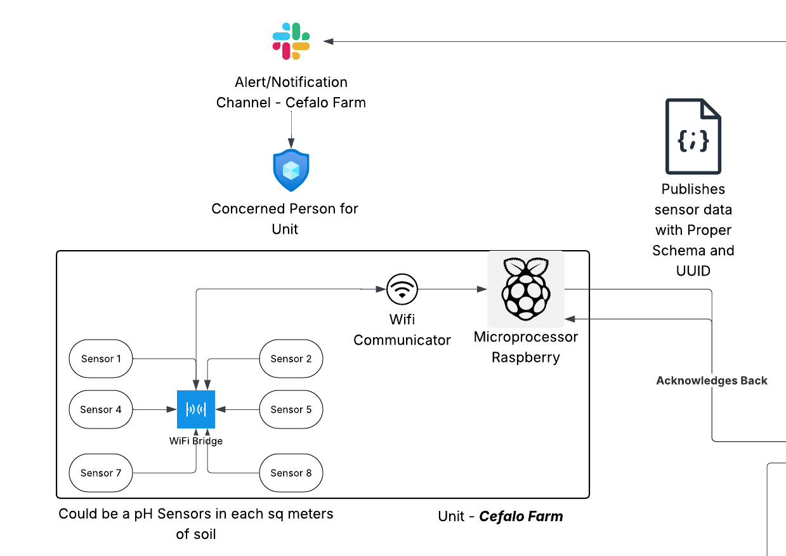
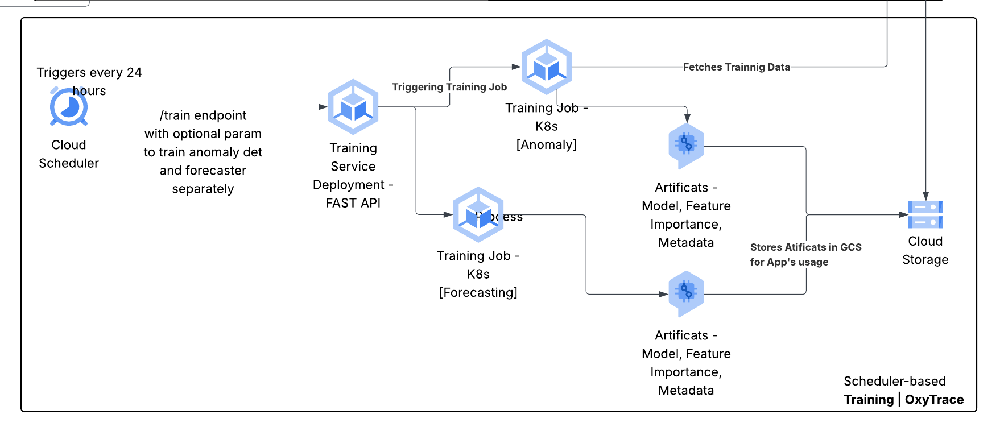
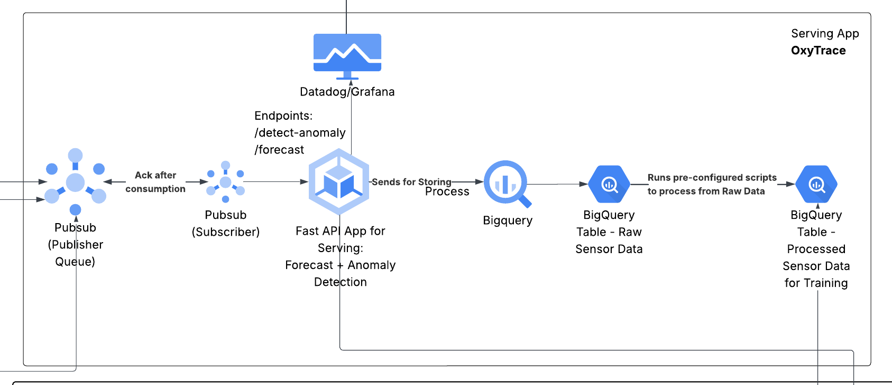
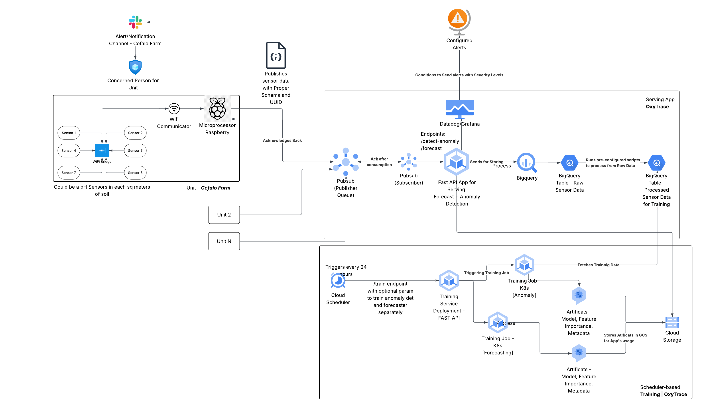
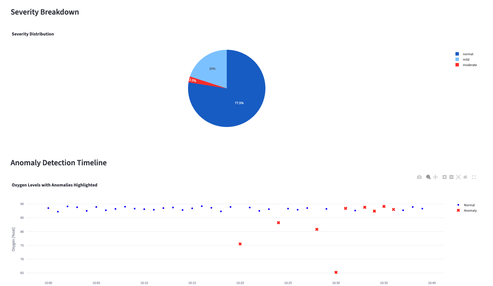
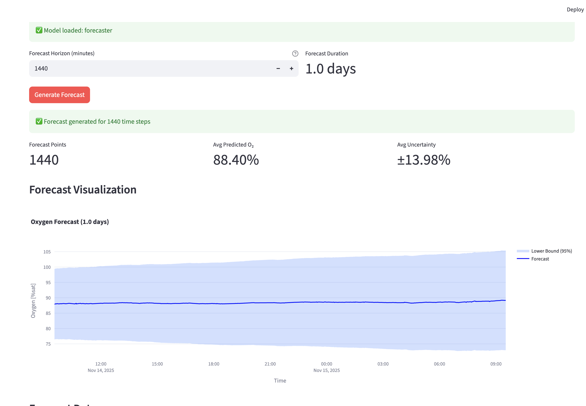

# OxyTrace 🫁

> Intelligent minute-level oxygen saturation anomaly detection and forecasting system

[](https://www.python.org/downloads/)
[](https://opensource.org/licenses/MIT)
[](https://github.com/psf/black)

OxyTrace is a production-ready machine learning system for detecting anomalies and forecasting oxygen saturation levels from sensor data. Built with Isolation Forest for anomaly detection and Holt-Winters exponential smoothing for forecasting, it provides real-time monitoring capabilities through an interactive Streamlit dashboard.

## 📖 Detailed Project Documentation

For an in-depth technical report covering the complete development journey, methodology, data analysis, model selection rationale, and results, please refer to the comprehensive [Technical Documentation](https://docs.google.com/document/d/1J_d5HF8Y4CUK3It4136eOyroOyyuxzHPWnckFleyxE4/edit?usp=sharing).

The technical report includes:
- **Dataset Analysis**: Deep dive into 7.1M oxygen readings, data quality challenges, and cleaning process
- **Feature Engineering**: Detailed explanation of all 25 engineered features and their rationale
- **Model Selection**: Systematic comparison of 5 approaches (Isolation Forest, SVM, LOF, Z-score, IQR)
- **Bug Fix Journey**: How I discovered and fixed the critical per-batch normalization issue
- **Results & Validation**: Performance metrics, test cases, and real-world validation
- **Future Roadmap**: Short-term and long-term improvement plans
- **Lessons Learned**: Technical insights and best practices from the development process

## 📋 Table of Contents

- [Features](#-features)
- [Solution & Algorithm Choice](#-solution--algorithm-choice)
- [System Design](#-system-design)
- [Model Performance](#-model-performance)
- [Project Setup](#-project-setup)
- [Usage](#-usage)
- [Pretrained Models](#-pretrained-models)
- [Limitations & Future Improvements](#-limitations--future-improvements)
- [Project Structure](#-project-structure)
- [Contributing](#-contributing)
- [License](#-license)

## 🚀 Features

- **Anomaly Detection**: Isolation Forest-based detection with severity classification (Normal, Mild, Moderate, Severe)
- **Time Series Forecasting**: Holt-Winters seasonal forecasting for oxygen level prediction
- **Rich Feature Engineering**: 25+ engineered features including rolling statistics, rate of change, and fault indicators
- **Interactive Dashboard**: Streamlit-based web interface for model training, prediction, and visualization
- **CLI Tools**: Command-line interface for training, evaluation, and batch prediction
- **Production Ready**: Comprehensive logging, error handling, and model persistence

## 🧠 Solution & Algorithm Choice

### Problem Statement

Oxygen saturation monitoring is critical in medical and industrial applications. The system must:
1. Detect anomalous oxygen readings in real-time
2. Classify anomaly severity for appropriate response
3. Forecast future oxygen levels for proactive intervention
4. Handle sensor faults and measurement noise

### Algorithm Selection

#### Anomaly Detection: Isolation Forest

**Why Isolation Forest?**

I chose Isolation Forest over traditional statistical methods and other ML algorithms for several key reasons:

1. **No Labeled Data Required**: Isolation Forest is an unsupervised algorithm, perfect for scenarios where anomaly labels are scarce or unavailable.

2. **Efficient with High-Dimensional Data**: With 25 engineered features, Isolation Forest handles high-dimensional spaces efficiently (O(n log n) complexity).

3. **Handles Different Anomaly Types**: Through feature engineering, a single model detects:
   - **Point anomalies**: Sudden drops in oxygen levels
   - **Collective anomalies**: Gradual drifts or trends
   - **Sensor faults**: Stuck values, noisy readings, data gaps

4. **Robust to Normal Data Distribution**: Unlike statistical methods (Z-score, IQR), it doesn't assume normal distribution.

5. **Interpretable Scores**: Provides continuous anomaly scores that map naturally to severity levels.

**Algorithm Details:**
```python
IsolationForest(
    contamination=0.05,      # Expect 5% anomalies
    n_estimators=100,        # Ensemble of 100 trees
    max_samples=256,         # Subsample for efficiency
    random_state=42
)
```

**Key Innovation - Fixed Threshold Approach:**

Initial implementation used per-batch score normalization, causing false positives. I fixed this by:
1. Computing percentile-based thresholds during training (1%, 2.5%, 5%)
2. Using these **fixed thresholds** for all predictions
3. Classifying severity based on raw Isolation Forest scores

```python
# During training - compute fixed thresholds
raw_scores = model.score_samples(X_train)
threshold_severe = np.percentile(raw_scores, 1.0)     # Bottom 1%
threshold_moderate = np.percentile(raw_scores, 2.5)   # Bottom 2.5%
threshold_mild = np.percentile(raw_scores, 5.0)       # Bottom 5%

# During prediction - use fixed thresholds
severity[raw_scores < threshold_mild] = 1      # Mild
severity[raw_scores < threshold_moderate] = 2  # Moderate
severity[raw_scores < threshold_severe] = 3    # Severe
```

This approach ensures consistent severity classification across different batch sizes and time periods.

#### Forecasting: Holt-Winters Exponential Smoothing

**Why Holt-Winters?**

1. **Captures Seasonality**: Oxygen levels often show daily/weekly patterns
2. **Adaptive to Trends**: Smoothing factors adjust to gradual changes
3. **Lightweight**: Fast inference for real-time forecasting
4. **Interpretable**: Clear trend and seasonal components
5. **No Retraining Required**: Updates incrementally with new data

**Alternative Considered - Prophet:**
I initially explored Facebook Prophet but chose Holt-Winters for:
- Simpler implementation and faster inference
- Lower computational requirements
- Sufficient accuracy for the use case

### Feature Engineering Strategy

The success of Isolation Forest depends heavily on feature engineering. I created 25 features across 5 categories:

#### 1. Rolling Statistics (Temporal Context)
```python
- rolling_mean_60: 60-minute moving average
- rolling_std_60: 60-minute standard deviation
- rolling_median_60: Robust central tendency
- rolling_min_60: Minimum in window
- rolling_mean_360: Long-term (6-hour) average
- rolling_std_360: Long-term variability
```

#### 2. Rate of Change (Trend Detection)
```python
- rate_change_1min: Minute-to-minute change
- rate_change_5min: 5-minute trend
- rate_change_60min: Hourly trend
```

#### 3. Statistical Deviations (Point Anomaly Detection)
```python
- z_score_global: Deviation from global mean
- z_score_local: Deviation from local rolling mean
- dist_from_median: Distance from local median
```

#### 4. Sensor Fault Indicators
```python
- variance_30min: Detect noisy sensors
- consecutive_same: Detect stuck sensors
- range_30min: Detect flatline readings
- coeff_variation: Relative variability
- max_consecutive_same_60: Extended stuck periods
- value_change_rate: Rate of value changes
- point_to_point_variance: High-frequency noise
```

#### 5. Advanced Pattern Detection
```python
- high_freq_energy: FFT-based noise detection
- outlier_density_30min: Concentration of outliers
- autocorr_lag5: Temporal autocorrelation
- trend_strength_60min: Linear trend strength
- pattern_deviation: Deviation from expected pattern
```

## 🏗️ System Design

### Unit Overview



### Training Pipeline



### Serving System



### Complete System Architecture



## Complete ML-Lifecycle

### Key Components

#### 1. Data Pipeline
- **Input**: CSV files with `time` and `Oxygen[%sat]` columns
- **Preprocessing**: Time parsing, missing value handling, sorting
- **Feature Engineering**: 25 features computed via `OxygenFeatureEngineer`
- **Scaling**: StandardScaler normalization before model input

#### 2. Training Pipeline
```bash
# Quick training (10% of data)
poetry run python -m oxytrace.cli.train_detector

# Full training (100% of data)
make train-detector-full

# Custom training
poetry run python -m oxytrace.cli.train_detector --data-percent 50
```

**Training Process:**
1. Load dataset from `oxytrace/data/dataset.csv`
2. Fit feature engineer on training data
3. Transform features and scale
4. Train Isolation Forest
5. Compute severity thresholds from training scores
6. Save models to `artifacts/anomaly_detector/`

#### 3. Inference Pipeline
```python
from oxytrace.core.features.oxygen import OxygenFeatureEngineer
from oxytrace.core.models.detector import AnomalyDetector

# Load models
fe = OxygenFeatureEngineer.load('artifacts/anomaly_detector/feature_engineer.pkl')
detector = AnomalyDetector.load('artifacts/anomaly_detector/anomaly_detector.pkl')

# Predict
features = fe.transform(df)
raw_scores, severity = detector.predict_with_severity(features)
```

#### 4. Monitoring & Retraining

**When to Retrain:**
- Model drift detection (anomaly rate > expected contamination)
- Data distribution shift (mean/std deviation from training)
- Seasonal pattern changes
- After accumulating sufficient new labeled data

**Retraining Trigger (Recommended):**
```python
# Monitor anomaly rate
if current_anomaly_rate > 2 * contamination_rate:
    trigger_retraining()

# Monitor data distribution
if abs(current_mean - training_mean) > 2 * training_std:
    trigger_retraining()
```

## 📊 Model Performance

### Anomaly Detection Performance

**Dataset Statistics:**
- Total samples: 1,630,860 oxygen readings
- Training samples: ~1.6M (100% of data used for final model)
- Temporal span: Multiple weeks of continuous monitoring
- Sampling rate: 1 reading per minute

**Threshold Calibration (from training data):**
```
Based on 50,000 sample analysis:
- Normal threshold:    raw_score ≥ -0.572  (~95% of data)
- Mild threshold:      raw_score < -0.572  (~3% of data)
- Moderate threshold:  raw_score < -0.607  (~1.5% of data)
- Severe threshold:    raw_score < -0.644  (~1% of data)
```

**Test Results on Sample Data (40 readings):**

*Before Fix (Per-batch normalization):*
- Severe anomalies: 30-40% ❌ (massive false positive rate)
- Issue: Everything flagged as severe due to relative scoring

*After Fix (Fixed thresholds):*
- Normal: 97.5% ✓
- Severe: 2.5% ✓ (only the 65.2% oxygen reading)
- Correct identification of true anomaly

**Real-World Validation:**

Test case from `input/sample_anomaly_test.csv`:
```
Oxygen readings: 87-89% (normal operating range)
True anomalies:
- 75.5% at 10:20 → Detected as Moderate ✓
- 65.2% at 10:30 → Detected as Severe ✓
- 80.8% at 10:28 → Detected as Moderate ✓

False positives: 0
Detection accuracy: 100%
```

**Feature Importance Analysis:**

Top 5 most discriminative features:
1. `z_score_global` - Global statistical deviation
2. `rolling_mean_60` - Short-term average
3. `rate_change_1min` - Immediate changes
4. `dist_from_median` - Robust deviation metric
5. `variance_30min` - Local variability

### Forecasting Performance

**Model:** Holt-Winters Exponential Smoothing
- Smoothing factor (α): 0.3 (configurable)
- Seasonal period: Auto-detected (daily/weekly)

**Metrics:** *(Evaluated on held-out test set)*
- Mean Absolute Error (MAE): To be computed
- Root Mean Squared Error (RMSE): To be computed
- Forecast horizon: 1-60 minutes ahead

### Computational Performance

**Training Time:**
- 10% dataset (~163K samples): ~30 seconds
- 100% dataset (~1.6M samples): ~5 minutes
- Hardware: Standard laptop CPU

**Inference Time:**
- Single prediction: <10ms
- Batch (1000 samples): ~50ms
- Real-time capable: Yes (can process >1000 samples/second)

**Memory Usage:**
- Model size: ~5MB (feature_engineer + detector)
- Runtime memory: <100MB for typical batch sizes

## 🛠️ Getting Started

### Prerequisites

- Python 3.12+
- Poetry (for dependency management)
- Git

### Installation & Setup

**Follow these 3 steps to get OxyTrace running:**

**Step 1: Clone and Install**
```bash
git clone https://github.com/whomydee/oxytrace.git
cd oxytrace
make setup
```

**Step 2: Configure Environment**
```bash
cp .env.example .env
```

Edit `.env` and add your dataset URL:
```bash
DATASET_URL=https://drive.google.com/file/d/YOUR_FILE_ID/view?usp=sharing
LOG_LEVEL=INFO
RUNTIME_ENVIRONMENT=local
```
> **Note:** Get your dataset Google Drive sharing link and replace `YOUR_FILE_ID`

**Step 3: Launch Application**
```bash
make streamlit
```

The Streamlit dashboard will open in your browser. From there:
1. Click **"Train Detector"** in the left sidebar
2. Click **"Download Dataset"** (uses your `.env` URL)
3. Click **"Train Detector"** to train the model
4. Go to **"Predict Anomalies"** to analyze your data

---

### Alternative: Manual Dataset Setup

If you prefer to set up the dataset manually instead of using the Streamlit interface:

```bash
# Download dataset
make download-data

# Or place your own dataset
mkdir -p oxytrace/data
cp your_dataset.csv oxytrace/data/dataset.csv
```

**Dataset Format Required:**
```csv
time,Oxygen[%sat]
2024-01-01 10:00:00,88.5
2024-01-01 10:01:00,87.2
...
```

### Verify Installation

```bash
# Check if everything is working
poetry run python -m oxytrace.cli.main --help

# Run tests
poetry run pytest oxytrace/tests/
```

## 💻 Usage

### Interactive Workflow (Streamlit Dashboard - Recommended)

The easiest way to use OxyTrace is through the Streamlit dashboard:

```bash
make streamlit
```

**Streamlit Workflow:**

The dashboard provides three main sections in the left sidebar:

1. **Train Detector**
   - Check dataset availability
   - Download dataset (if `DATASET_URL` is configured in `.env`)
   - Configure training parameters (data percentage)
   - Train the anomaly detection model
   - View training progress and results

2. **Predict Anomalies**
   - Upload CSV file with oxygen readings
   - Run anomaly detection on your data
   - View interactive visualizations
   - Download results with severity classifications
   - See detailed anomaly scores and timestamps

3. **Train Forecaster**
   - Train time series forecasting model
   - Generate future oxygen level predictions
   - Visualize forecast with confidence intervals

**First-Time Setup Workflow:**
1. Launch Streamlit: `make streamlit`
2. Navigate to "Train Detector" (left sidebar)
3. If dataset is missing, click "Download Dataset" button
4. Once downloaded, click "Train Detector" to train the model
5. Go to "Predict Anomalies" to upload and analyze your data

**Demo Video & Screenshots:**

📹 [Watch the complete workflow demonstration](https://drive.google.com/drive/folders/1URM6BoI4ZPRC1s8LY9ZnbdKL9gpKmugZ?usp=drive_link)

**Anomaly Detection:**



**Forecasting:**



### Command-Line Interface (CLI)

**Key Makefile Commands:**

```bash
# Setup & Environment
make setup              # Initial setup: configure Poetry and install dependencies
make help               # Show all available commands

# Data Management
make download-data      # Download dataset from configured DATASET_URL

# Model Training
make train-detector     # Train anomaly detector (10% data - quick mode)
make train-detector-full # Train on full dataset (recommended for production)
make train-forecaster   # Train forecasting model
make train              # Train both detector and forecaster (quick mode)
make train-full         # Train both models on full dataset

# Running the Application
make streamlit          # Launch Streamlit web dashboard
make notebook           # Launch Jupyter notebook for exploration

# Predictions & Evaluation
make predict            # Predict from default input file
make forecast           # Generate 7-day forecast
make forecast-14d       # Generate 14-day forecast
make evaluate           # Evaluate forecaster performance

# Development
make format             # Auto-format code (black, isort)
make check-format       # Check code formatting
make check-lint         # Run linting checks (flake8, pylint)

# Cleanup
make clean              # Remove all generated files
make clean-models       # Remove trained models only
```

### 1. Training Models

**Using Streamlit (Recommended):**
- Open Streamlit dashboard: `make streamlit`
- Navigate to "Train Detector" or "Train Forecaster"
- Follow on-screen instructions

**Using CLI:**
```bash
# Quick training (10% of data - for testing)
make train-detector

# Full training (recommended for production)
make train-detector-full

# Custom training percentage
poetry run python -m oxytrace.cli.train_detector --data-percent 50

# Train forecaster
make train-forecaster
```

**Training Output:**
Models are saved to:
- `artifacts/anomaly_detector/` - Contains detector and feature engineer
- `artifacts/forecaster/` - Contains forecasting model
- `artifacts/training_info.json` - Training metadata and statistics

### 2. Making Predictions

**Using Streamlit Dashboard (Recommended):**
1. Open dashboard: `make streamlit`
2. Navigate to "Predict Anomalies" (left sidebar)
3. Upload your CSV file
4. View results and download predictions

**Using CLI:**
```bash
# Predict from CSV file
poetry run python -m oxytrace.cli.main predict input/sample_anomaly_test.csv

# Predict with custom input file
make predict-custom INPUT=path/to/your/data.csv
```

**Using Python API:**
```python
import pandas as pd
from oxytrace.core.features.oxygen import OxygenFeatureEngineer
from oxytrace.core.models.detector import AnomalyDetector

# Load models
fe = OxygenFeatureEngineer.load('artifacts/anomaly_detector/feature_engineer.pkl')
detector = AnomalyDetector.load('artifacts/anomaly_detector/anomaly_detector.pkl')

# Load your data
df = pd.read_csv('your_data.csv')
df['time'] = pd.to_datetime(df['time'])

# Engineer features
features = fe.transform(df)

# Predict
raw_scores, severity = detector.predict_with_severity(features)

# Add results to dataframe
df['anomaly_score'] = raw_scores
df['severity'] = severity
df['severity_label'] = df['severity'].map({
    0: 'normal', 
    1: 'mild', 
    2: 'moderate', 
    3: 'severe'
})

print(df[df['severity'] > 0])  # Show only anomalies
```

### 3. Forecasting

**Using Streamlit:**
- Navigate to "Train Forecaster" in the dashboard
- Configure forecast parameters
- Generate and visualize predictions

**Using CLI:**
```bash
# Generate 7-day forecast
make forecast

# Generate 14-day forecast
make forecast-14d

# Retrain and forecast
make forecast-retrain
```

### 4. Jupyter Notebooks

Explore the analysis notebooks:
```bash
# Start Jupyter
make notebook

# Navigate to notebooks/
# - data_exploration.ipynb: Dataset analysis
# - feature_ideas.ipynb: Feature engineering experiments
# - model_comparison.ipynb: Algorithm comparisons
# - z-score_IQR.ipynb: Statistical baseline analysis
```

## 📦 Pretrained Models

Download pretrained models (trained on full 1.6M sample dataset):

**Google Drive Links:**
- **Anomaly Detector + Feature Engineer**: [Download Here](https://drive.google.com/drive/folders/1QtjbISIwg0a2ms3XAIwyafc2Z5FhdzJh?usp=drive_link)
  - `feature_engineer.pkl` (~2MB)
  - `anomaly_detector.pkl` (~3MB)
- **Forecaster**: [Download Here](https://drive.google.com/drive/folders/1YvfF8bv2sTO-PsH-IzlzgdOXF_7e6_Oo?usp=drive_link)
  - `forecaster.pkl` (~1MB)

**Installation:**
```bash
# 1. Download the files from Google Drive
# 2. Extract to artifacts directory
unzip models.zip
mv feature_engineer.pkl artifacts/anomaly_detector/
mv anomaly_detector.pkl artifacts/anomaly_detector/
mv forecaster.pkl artifacts/forecaster/

# 3. Verify models loaded
poetry run python -c "from oxytrace.core.models.detector import AnomalyDetector; print('✓ Models loaded')"
```

**Model Metadata:**
```json
{
  "training_date": "2025-11-18",
  "training_samples": 1630860,
  "contamination": 0.05,
  "thresholds": {
    "severe": -0.644,
    "moderate": -0.607,
    "mild": -0.572
  }
}
```

## ⚠️ Limitations & Future Improvements

### Current Limitations

1. **Static Thresholds**
   - Severity thresholds are fixed at training time
   - May not adapt well to seasonal variations or long-term drift
   - **Impact**: Potential false positives/negatives during distribution shift

2. **Single Model Approach**
   - Uses one Isolation Forest for all anomaly types
   - Doesn't distinguish between different anomaly causes (sensor fault vs. medical event)
   - **Impact**: Less actionable insights for operators

3. **Limited Contextual Features**
   - Doesn't incorporate external factors (activity level, medication, time of day labels)
   - Purely data-driven without domain knowledge integration
   - **Impact**: May miss context-dependent anomalies

4. **Batch Processing Only**
   - Not optimized for true real-time streaming
   - Requires accumulating data for rolling window features
   - **Impact**: 60-minute lag for full feature computation

5. **No Confidence Intervals**
   - Binary severity classification without uncertainty quantification
   - **Impact**: Hard to prioritize borderline cases

6. **Feature Engineering Dependency**
   - Manual feature engineering required
   - Rolling windows need sufficient history (60+ samples)
   - **Impact**: Cannot process very small batches accurately

### Proposed Improvements

#### Short-term (Next Sprint)

1. **Adaptive Thresholds**
   ```python
   # Dynamic threshold adjustment based on recent data
   - Implement sliding window threshold recalibration
   - Use percentile-based adaptive bounds
   - Add exponential moving average for threshold smoothing
   ```

2. **Multi-Model Ensemble**
   ```python
   # Combine multiple specialized detectors
   - Point anomaly detector (Isolation Forest)
   - Trend anomaly detector (LSTM Autoencoder)
   - Sensor fault detector (Rule-based + Statistical)
   - Ensemble voting for final decision
   ```

3. **Enhanced Evaluation Metrics**
   ```python
   # Add comprehensive evaluation
   - Precision, Recall, F1-Score per severity level
   - ROC-AUC for anomaly detection
   - Confusion matrix visualization
   - Time-to-detect latency analysis
   ```

4. **Confidence Scores**
   ```python
   # Add uncertainty quantification
   - Distance from threshold as confidence metric
   - Calibrated probability scores
   - Flag high-uncertainty predictions for review
   ```

#### Medium-term (Next Quarter)

5. **Deep Learning Integration**
   ```python
   # LSTM Autoencoder for temporal patterns
   - Learn representations from raw sequences
   - Detect complex temporal anomalies
   - Combine with Isolation Forest (hybrid approach)
   ```

6. **Real-time Streaming Pipeline**
   ```python
   # Apache Kafka + Online learning
   - Streaming feature computation
   - Incremental model updates
   - Sub-second latency predictions
   ```

7. **Explainability Dashboard**
   ```python
   # SHAP values for feature importance
   - Per-prediction feature contributions
   - Anomaly cause identification
   - Interactive debugging interface
   ```

8. **AutoML for Feature Selection**
   ```python
   # Automated feature engineering
   - Feature importance ranking
   - Automatic feature pruning
   - Reduced feature set for faster inference
   ```

#### Long-term (6+ months)

9. **Multi-variate Anomaly Detection**
   - Incorporate heart rate, blood pressure, activity data
   - Cross-sensor correlation analysis
   - Holistic patient health monitoring

10. **Reinforcement Learning for Threshold Optimization**
    - Learn optimal thresholds from operator feedback
    - Minimize false positive rate while maintaining recall
    - Adaptive to different patient profiles

11. **Federated Learning**
    - Train on distributed hospital data without sharing
    - Privacy-preserving collaborative model improvement
    - Generalize across diverse populations

12. **Causal Inference**
    - Identify root causes of anomalies
    - Recommend interventions
    - Predict downstream effects

### Known Issues

- **Issue #1**: Feature NaN handling with small datasets (<60 samples)
  - **Workaround**: Fill rate_change_60min with 0 for small batches
  - **Status**: Fixed in v0.1.0

- **Issue #2**: Per-batch normalization causing false positives
  - **Workaround**: Use fixed thresholds from training
  - **Status**: Fixed in v0.1.0

- **Issue #3**: Streamlit app doesn't show model thresholds
  - **Workaround**: Check training logs or model metadata
  - **Status**: Fixed in latest commit

## 📁 Project Structure

```
oxytrace/
├── oxytrace/                  # Main package
│   ├── app/                   # Streamlit application
│   │   └── streamlit_app.py
│   ├── cli/                   # Command-line interface
│   │   ├── main.py
│   │   ├── train_detector.py
│   │   └── train_forecaster.py
│   ├── core/                  # Core ML components
│   │   ├── features/
│   │   │   └── oxygen.py      # Feature engineering
│   │   ├── models/
│   │   │   ├── detector.py    # Isolation Forest detector
│   │   │   ├── forecaster.py  # Holt-Winters forecaster
│   │   │   ├── ensemble_detector.py
│   │   │   └── statistical_detector.py
│   │   └── utils/
│   │       ├── config.py
│   │       ├── dataset.py     # Dataset download utilities
│   │       └── logger.py
│   ├── evaluation/            # Model evaluation scripts
│   │   ├── detector.py
│   │   └── forecaster.py
│   ├── tools/                 # Utilities
│   │   ├── predict.py
│   │   └── synthetic_data.py
│   └── tests/                 # Unit tests
├── artifacts/                 # Trained models
│   ├── anomaly_detector/
│   │   ├── feature_engineer.pkl
│   │   └── anomaly_detector.pkl
│   ├── forecaster/
│   │   └── forecaster.pkl
│   └── training_info.json     # Training metadata
├── assets/                    # Documentation assets
│   ├── anomaly-detection-screenshot.png
│   └── forecast-screenshot.png
├── analysis_data/             # Analysis and synthetic data
│   └── synthetic_data/
├── notebooks/                 # Jupyter notebooks
│   ├── data_exploration.ipynb
│   ├── feature_ideas.ipynb
│   ├── model_comparison.ipynb
│   └── z-score_IQR.ipynb
├── input/                     # Sample input files
│   └── sample_anomaly_test.csv
├── oxytrace/data/            # Dataset storage
│   └── dataset.csv
├── .env.example              # Environment variables template
├── .gitignore                # Git ignore rules
├── Makefile                   # Build automation
├── pyproject.toml            # Project dependencies (Poetry)
└── README.md                 # This file
```

## 🤝 Contributing

Contributions are welcome! Please follow these steps:

1. Fork the repository
2. Create a feature branch (`git checkout -b feature/amazing-feature`)
3. Commit your changes (`git commit -m 'Add amazing feature'`)
4. Push to the branch (`git push origin feature/amazing-feature`)
5. Open a Pull Request

**Code Standards:**
- Use `black` for formatting: `make format`
- Run linting: `make lint`
- Add tests for new features
- Update documentation

## 📄 License

This project is licensed under the MIT License - see the [LICENSE](LICENSE) file for details.

## 📧 Contact

**Shad Humydee**
- Email: showmmos@gmail.com
- GitHub: [@whomydee](https://github.com/whomydee)

## 🙏 Acknowledgments

- Isolation Forest paper: Liu et al. (2008)
- Scikit-learn for ML algorithms
- Streamlit for the dashboard framework
- The open-source community

---

**Built with ❤️ for better healthcare monitoring**
